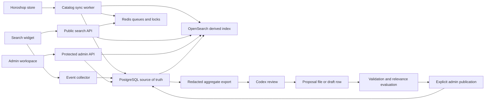

# Horoshop intelligent search — target technical specification v1.0

Status: approved for implementation on 2026-08-08.

Implementation snapshot (2026-08-23):

- Stage 0 foundation is complete.
- The Horoshop connection and PostgreSQL catalog mirror from Stage 1 are implemented.
- Accessory and photo tools were delivered as additional consumers of that catalog boundary.
- OpenSearch indexing/query, Redis integration, search widget, linguistic rulesets and search
  analytics are not implemented.

Unless a section explicitly says **implemented**, this document describes the approved target, not
an endpoint, table or UI that can be used today. Current contracts are documented in
`architecture.md`, `HOROSHOP_CATALOG_IMPORT.md` and `IMPLEMENTATION_PLAN.md`.

## 1. Objective

Build an external product-search service and embeddable JavaScript widget for the real Horoshop
store. The service synchronizes the Horoshop catalog, indexes it independently, provides fast
Ukrainian-first search, collects detailed behavioral analytics, and gives administrators controlled
tools for search relevance, morphology exceptions, synonyms, and product-specific aliases.

The first production installation serves one store, while identifiers and data ownership remain
tenant-aware so the service can evolve into a multi-tenant product.

## 2. Fixed decisions

- Horoshop API is the primary catalog source; a product feed is a fallback, not an equal source.
- The external Horoshop catalog is separate from the existing local used-smartphone storefront.
- PostgreSQL is authoritative for normalized products, rules, proposals, versions, and audit data.
- OpenSearch is a rebuildable search index and uses the `analysis-ukrainian` plugin.
- Redis is used for queues, locks, and short-lived caches once the corresponding workers exist.
- The widget is an asynchronous, domain-authorized Web Component and never receives store secrets.
- Standard morphology is automatic. Administrators manage only protected terms and scoped
  exceptions, not every word form.
- Global/category synonym expansion happens at query time. Product aliases are indexed only on the
  corresponding product.
- Published linguistic rulesets are immutable and rollbackable.
- Codex is an offline reviewer that writes proposals. Runtime search never calls Codex or an LLM.

## 3. System context

The following diagram is the target Stage 2–5 context. At present, the `Horoshop -> sync worker ->
PostgreSQL` path exists; OpenSearch, Redis, widget, event collector and linguistic publication
nodes do not.



## 4. Horoshop integration

### 4.1 Connection

The backend stores a store domain, enabled locales, synchronization settings, and encrypted API
credentials. Credentials are never logged or returned to the browser after creation.

The current connector already verifies authentication and reads categories/catalog. Before changing
its contract or enabling search in production, reconfirm pagination, multilingual fields, rate
limits and order-event availability against official documentation and a staging account with
non-destructive requests.

### 4.2 Imported data

- external product and parent IDs;
- variant/modification IDs;
- SKU/article;
- localized titles and descriptions;
- category hierarchy;
- brand;
- characteristics and units;
- current and old price, currency;
- availability and stock;
- primary image and gallery;
- canonical product URL and slug;
- visibility, popularity, badges, and other exposed business flags.

### 4.3 Synchronization modes

Target modes/capabilities:

- initial full import;
- scheduled polling, default every 15 minutes;
- nightly full reconciliation;
- manual sync;
- single-product reindex;
- retry with bounded exponential backoff;
- deletion/visibility reconciliation;
- run history with counts, cursor, duration, warnings, and errors.

A missing product is first marked inactive and is removed from the active index only after a
complete reconciliation confirms its absence. Imports are idempotent by tenant and external ID.

Current implementation provides initial full, manual and scheduled full traversal with
signature-based differential writes, inactive reconciliation and sync history. Nightly-specific
reconciliation, single-product reindex and bounded exponential retry are Stage 2/operations work.

## 5. Search index and query processing

### 5.1 Multifields

Searchable text is represented through separate fields rather than one destructive normalization:

```text
title.exact
title.uk_morph
title.ru_morph
title.synonym
title.translit
title.ngram
title.fuzzy
sku.keyword
brand.keyword
model.keyword
category
characteristics
product_aliases
```

SKU, model codes, brands, numbers, and protected terms retain exact representations.

### 5.2 Query pipeline

1. Unicode and whitespace normalization.
2. Exact SKU/model/brand recognition.
3. Language detection or explicit locale selection.
4. Keyboard-layout candidate generation.
5. Transliteration candidate generation.
6. Ukrainian or Russian morphology.
7. Scoped synonym expansion.
8. Length-aware typo tolerance.
9. Facet and availability filtering.
10. Ranking and business boosts.

The ranking priority is exact SKU/model, exact title, exact phrase, product alias, brand/model,
morphology, synonym, transliteration, and finally fuzzy matching. Fuzzy matching must not modify
short codes or SKUs aggressively.

### 5.3 Public response

Every response includes a `query_id`, original and normalized query, optional correction, products,
facets, total, processing time, index version, and linguistic ruleset version.

## 6. Linguistic rules

### 6.1 Hierarchy and precedence

```text
platform/global
  -> tenant/store
    -> category
      -> brand
        -> product aliases
          -> product exclusions (highest priority)
```

Rules may be equivalent, directional, translation, transliteration, abbreviation, colloquial,
common typo, brand alias, or model alias. Each rule has a stable ID, language, scope, weight,
source, confidence, status, creator, evidence, and version.

### 6.2 Morphology

The Ukrainian analyzer operates on eligible text fields for all products. Administrators may add:

- protected terms;
- lemma overrides;
- language overrides;
- ignored terms;
- category or product exceptions.

Bundled third-party morphology data is not edited through the application.

### 6.3 Product-level control

An administrator can open any synchronized product and:

- add or remove its own search alias;
- add a transliteration or colloquial name;
- protect a brand/model term;
- override a lemma;
- suppress an inherited synonym for this product;
- forbid the product for a specific query;
- preview results before and after the change;
- reindex only that product.

Horoshop synchronization must not erase these project-owned overrides.

### 6.4 Ruleset lifecycle

Statuses are `candidate`, `draft`, `approved`, `published`, `rejected`, and `deprecated`.
Published versions are immutable. Publication creates a new version, stores validation/evaluation
evidence, records an audit entry, and preserves rollback. Index aliases permit zero-downtime index
switching when a full rebuild is necessary.

## 7. Widget

The widget is loaded asynchronously using a public site ID and a domain allowlist. It can attach to
an existing Horoshop search input or render a standalone input. Desktop uses a dropdown/modal;
mobile uses a full-screen search mode.

Required behavior:

- suggestions after a 150–250 ms debounce;
- products, categories, images, prices, availability, and highlighted matches;
- keyboard navigation, focus management, Escape, Enter, and screen-reader labels;
- facets and correction messages;
- useful zero-results state;
- product navigation and optional cart action after Horoshop compatibility verification;
- `query_id` propagation to click, cart, and purchase events;
- configurable theme without untrusted arbitrary script execution.

The widget must not block Horoshop rendering, must fail open when analytics is unavailable, and must
never expose integration credentials.

## 8. Administration

Roles: owner, search manager, analyst, viewer.

Required areas:

- dashboard and system health;
- Horoshop connection and sync history;
- synchronized products and product search overrides;
- synonyms, transliterations, typos, abbreviations, protected terms, and morphology exceptions;
- proposals, rejected proposals, rulesets, publication, and rollback;
- result preview and golden-query regressions;
- widget appearance and domain configuration;
- analytics and exports;
- immutable audit history.

## 9. Analytics

### 9.1 Events

`widget_open`, `query_search`, `results_impression`, `result_click`, `filter_apply`,
`zero_results`, `query_reformulation`, `add_to_cart`, `purchase`, and `widget_close`.

An event may contain tenant, pseudonymous session/user IDs, query ID, raw and normalized query,
locale, result count, product ID, rank, filters, device, page, referrer, latency, ruleset version,
index version, and timestamp.

### 9.2 Metrics and reports

- search sessions and queries;
- zero-results and abandonment rates;
- CTR and CTR@1/3/10;
- reformulation rate and common query transitions;
- add-to-cart and purchase conversion after search;
- attributed and assisted revenue;
- average click position;
- p50/p95 latency;
- products with impressions but no clicks;
- language/category/brand/device breakdowns;
- per-rule and per-ruleset impact.

The primary attribution is the last search click within the session. Assisted attribution uses a
configurable window. Raw query retention defaults to 90 days; aggregate retention is configured
separately. Queries are redacted before Codex export.

## 10. Codex improvement workflow

Codex receives an aggregate, redacted export plus current approved/rejected rules, a catalog search
snapshot, ruleset/index versions, and golden queries. It emits structured `ADD`, `DEPRECATE`,
`REWEIGHT`, or `RESCOPE` proposals with evidence and confidence.

```text
events -> aggregate export -> Codex proposal -> schema validator
       -> offline relevance evaluation -> human approval -> new ruleset -> monitoring/rollback
```

Codex has read-only production access and proposal-only write access. No proposal is published
automatically in v1.

## 11. Core data entities

### 11.1 Current implemented entities

```text
search_horoshop_connections
search_horoshop_sync_runs
search_horoshop_categories
search_horoshop_products
search_horoshop_modifications
search_horoshop_audit_log
search_horoshop_accessory_*
search_horoshop_photo_*
```

The current connection is singleton and generation-scoped. These tables are the external Horoshop
mirror and companion workflow state, not the final tenant-aware search schema.

### 11.2 Target intelligent-search entities

```text
search_tenants
search_sites
search_horoshop_connections
search_sync_runs
search_categories
search_products
search_product_variants
search_product_overrides
search_rulesets
search_synonym_rules
search_morphology_overrides
search_protected_terms
search_rule_proposals
search_proposal_evidence
search_events
search_query_aggregates
search_query_transitions
search_conversion_events
search_golden_queries
search_evaluation_runs
search_audit_log
```

Search-domain table names use a `search_` prefix until/unless the domain is extracted into a
separate database.

## 12. APIs

The routes below are planned target APIs and do not exist yet. Current Horoshop admin/catalog,
accessory and photo endpoints are documented in `HOROSHOP_CATALOG_IMPORT.md`.

Planned public:

```text
GET  /api/search/widget/config
POST /api/search/query
GET  /api/search/suggest
POST /api/search/events/batch
GET  /search-widget.js
```

Planned protected administration:

```text
POST /api/search/admin/horoshop/connect
POST /api/search/admin/sync/run
GET  /api/search/admin/sync/runs
GET  /api/search/admin/products
GET  /api/search/admin/products/:id
POST /api/search/admin/products/:id/aliases
POST /api/search/admin/products/:id/exclusions
POST /api/search/admin/products/:id/reindex
GET  /api/search/admin/rules
POST /api/search/admin/rules
POST /api/search/admin/rules/validate
GET  /api/search/admin/proposals
POST /api/search/admin/proposals/:id/approve
POST /api/search/admin/proposals/:id/reject
POST /api/search/admin/rulesets/publish
POST /api/search/admin/rulesets/:id/rollback
GET  /api/search/admin/analytics/*
POST /api/search/admin/analytics/codex-export
```

## 13. Non-functional requirements

- Search API target p95: 300 ms under the agreed reference load.
- Search/index/event operations are tenant-isolated and idempotent where applicable.
- OpenSearch and Redis are not publicly exposed.
- HTTPS, domain allowlists, CORS, rate limits, input validation, RBAC, and audit logging are required.
- Horoshop credentials are encrypted at rest and absent from client responses and logs.
- Analytics failure cannot block search; Codex failure cannot affect runtime.
- Full backups, health checks, structured logs, retries, index aliases, and rollback are required.
- The widget supports keyboard navigation, appropriate focus, screen readers, mobile touch, contrast,
  and reduced motion.

## 14. Testing and acceptance

Testing includes normalization/rule unit tests, Horoshop contract tests, PostgreSQL/OpenSearch
integration tests, widget/admin E2E tests, tenant-isolation tests, load tests, accessibility tests,
and relevance regression tests.

Before production, create 300–1000 catalog-grounded golden queries with expected and forbidden
products/categories. Critical golden-query regressions block publication.

The MVP is accepted when catalog sync, Ukrainian morphology, exact/SKU/brand search, keyboard
layout, transliteration, typo tolerance, scoped and product rules, widget desktop/mobile behavior,
analytics, product overrides, preview, proposal export, explicit publication, ruleset versioning,
rollback, audit, and the relevant automated tests all work against the real Horoshop integration.

## 15. Delivery stages

0. **Complete:** repository audit, durable instructions, specification, ADRs, opt-in infrastructure,
   and baseline.
1. **Application implementation complete:** Horoshop connector, external catalog schema,
   synchronization and reconciliation. Production search operations inputs remain open.
2. **Not started:** OpenSearch mappings, indexing, query pipeline and linguistic core.
3. **Not started:** embeddable widget and Horoshop storefront integration.
4. **Not started:** search administration, analytics, preview and ruleset management.
5. **Not started:** linguistic Codex export/proposal workflow, relevance evaluations, hardening and
   production rollout.

Deferred from MVP: autonomous AI publication, personalization, recommendations, voice/image search,
AI shopping chat, SaaS billing, and connectors for additional commerce platforms.

